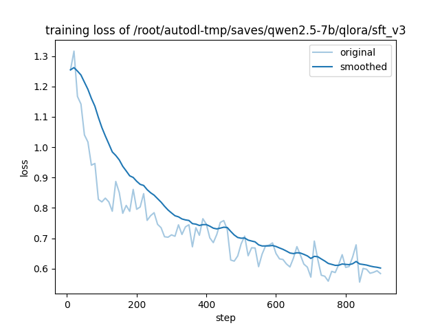
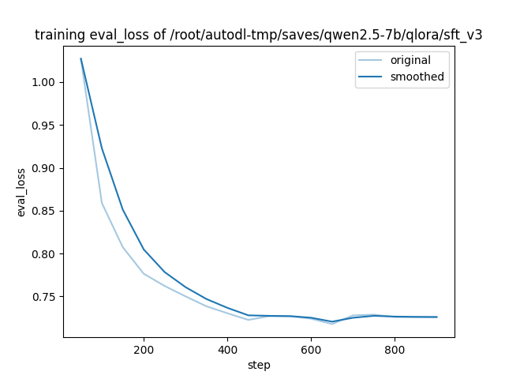
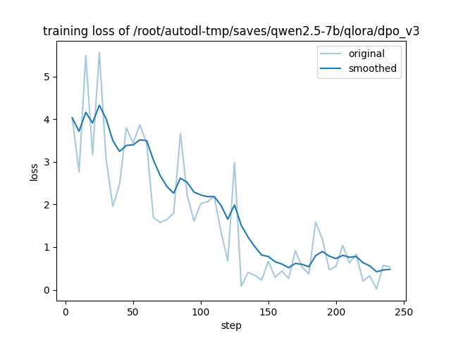
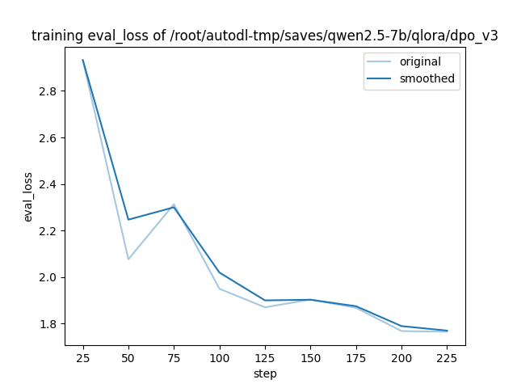
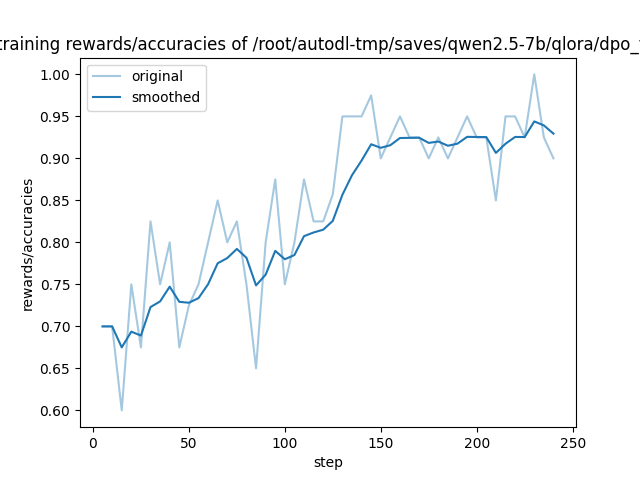

# Qwen2.5-7B 代码审查助手：QLoRA SFT + DPO 全流程

基于 **Qwen2.5-7B-Instruct**，使用 **QLoRA（NF4 + 双重量化）** 训练代码审查助手，并通过 **DPO 偏好对齐**进一步优化输出质量。项目共迭代两版（pro / v3），本仓库主推 **v3 版本**——数据规模 4 倍扩大、加入对抗样本与多轮追问、on-policy DPO 数据生成。

---

## 项目概述

| 项目 | 详情 |
|------|------|
| 基座模型 | Qwen2.5-7B-Instruct |
| 微调框架 | LLaMA-Factory |
| 量化方案 | QLoRA（NF4 + Double Quantization） |
| 训练流程 | SFT v3 → DPO v3（on-policy） |
| 数据生成 | DeepSeek API（deepseek-chat = V3） |
| 训练环境 | AutoDL vGPU 48GB（PyTorch 2.4 + CUDA 12.1 + Flash Attention 2） |

---

## 目录结构

```
├── configs/
│   ├── qwen_qlora_sft_v3.yaml         # SFT v3 主配置（rank=32, 3 epoch, cutoff=2048）
│   ├── qwen_qlora_dpo_v3.yaml         # DPO v3 主配置（on-policy, β=0.3, sigmoid）
│   ├── qwen_merge_sft_v3.yaml         # SFT v3 LoRA 合并配置（用于推理部署）
│   ├── qwen_qlora_sft_pro.yaml        # 旧版 pro 配置（保留供对比）
│   └── qwen_qlora_dpo.yaml            # 旧版 DPO 配置（保留供对比）
├── scripts/
│   ├── generate_sft_data.py           # SFT 数据生成（DeepSeek API）
│   ├── build_final_dataset.py         # 多源数据整合 + 划分
│   ├── filter_sft_data.py             # 数据质量过滤
│   ├── scrape_github.py               # 爬取 GitHub 真实代码片段
│   ├── analyze_sft_data.py            # 数据质量分析
│   ├── check_token_length.py          # Token 长度分布检查（v3 支持三类样本统计）
│   ├── build_dpo_data_v3.py           # DPO v3 on-policy 数据构造（4 次采样 + DeepSeek 打分）
│   ├── build_dpo_adversarial.py       # 对抗样本 DPO 对补充脚本
│   └── batch_eval.py                  # 批量推理评测（单模型 / 三模型对比）
├── data/
│   ├── final/
│   │   ├── sft_v3_train.json          # SFT v3 训练集（2541 条）
│   │   ├── sft_v3_val.json            # SFT v3 验证集（133 条）
│   │   └── sft_v3_test.json           # SFT v3 测试集（60 条）
│   ├── dpo_v3_onpolicy.json           # DPO v3 偏好数据（1070 对，on-policy）
│   ├── eval_base.json                 # 60 条 base 模型推理结果
│   ├── eval_sft_v3.json               # 60 条 SFT v3 推理结果
│   ├── eval_dpo_v3.json               # 60 条 DPO v3 推理结果
│   └── dataset_info.json              # LLaMA-Factory 数据集注册表
├── assets/results/                    # 训练曲线图
└── README.md
```

---

## 训练流程

### 第一步：SFT v3 数据构建（2734 条 = 训练 2541 + 验证 133 + 测试 60）

相比 pro 版本（975 条），v3 数据规模扩大近 3 倍，并新增两类样本类型：

| 类型 | 数量占比 | 说明 |
|------|---------|------|
| **正常审查** | ~80% | 代码片段 + 专业审查意见，覆盖 6+ 语言 / 6 类缺陷 |
| **对抗样本** | ~10% | 无代码输入（写诗、闲聊、prompt 注入等），训练拒答能力 |
| **多轮追问** | ~10% | 含 history，模拟用户在审查后追问"如果数据量变大会怎样"等深入问题 |

数据来源：DeepSeek V3 生成主集 + GitHub 真实代码片段 + 正确代码反向样本。

### 第二步：QLoRA SFT v3 训练

```yaml
# configs/qwen_qlora_sft_v3.yaml 关键配置
quantization_bit: 4
double_quantization: true
flash_attn: fa2
lora_rank: 32
lora_alpha: 64
cutoff_len: 2048
num_train_epochs: 3.0
learning_rate: 3.0e-5
gradient_accumulation_steps: 8     # 等效 batch=8
```

**最佳 checkpoint**：step 900，eval_loss = **0.7258**

**SFT v3 训练曲线：**

| Training Loss | Eval Loss |
|:---:|:---:|
|  |  |

> ⚠️ 经验教训：v3 训练时未设置 `load_best_model_at_end`，最优 checkpoint-650（eval_loss=0.7177）被 `save_total_limit` 淘汰。最终使用 checkpoint-900，差距约 0.008（1% 相对损失）。后续 DPO yaml 已补上该配置。

### 第三步：DPO v3 偏好对齐（On-Policy）

**v3 采用 on-policy 数据构造**——rejected 来自 SFT v3 模型本身的实际采样输出，而非"猜测"，避免 DPO 退化（v2 off-policy 失败的根因）。

构造流程（`scripts/build_dpo_data_v3.py`）：
1. 从训练集采样 1500 条 prompt
2. 对每条 prompt 用 SFT v3 模型采样 4 次（温度梯度 0.7 / 0.85 / 1.0 / 1.1）
3. DeepSeek V3 作为 judge 对 4 个输出打分（1-5）
4. 选 best/worst 配对，要求 `best - worst ≥ 1.5` 且 `best ≥ 3.5`
5. 最终生成 **1070 对**有效偏好数据

```yaml
# configs/qwen_qlora_dpo_v3.yaml 关键配置
adapter_name_or_path: .../sft_v3/checkpoint-900     # 基于 SFT v3 继续训练
lora_rank: 8
pref_beta: 0.3                  # on-policy 数据可用更大 beta
pref_loss: sigmoid
flash_attn: fa2
cutoff_len: 2048                # 多轮样本需要更长上下文
num_train_epochs: 2.0
load_best_model_at_end: true    # 自动保留最优 checkpoint
metric_for_best_model: eval_loss
```

**DPO v3 训练曲线：**

| Training Loss | Eval Loss | Rewards Accuracies |
|:---:|:---:|:---:|
|  |  |  |

**DPO v3 训练指标**：

| 指标 | 数值 |
|---|---|
| eval_loss | 1.76（↓ from 2.9） |
| rewards/accuracies | 0.86 |
| rewards/margins | 16.76 |
| train_loss | 0.5 |

---

## 评测结果

### 60 条测试集自动推理 + 14 条代表性样本人工评分

抽取 14 条覆盖三类样本的代表性测试用例（6 对抗 + 4 正常 + 4 多轮追问），人工对比 Base / SFT v3 / DPO v3：

| 维度 | Base | SFT v3 | DPO v3 |
|------|:---:|:---:|:---:|
| 对抗拒答（/30）| 5 | **25** | 19 |
| 正常审查（/20）| 10 | 16 | 16 |
| 多轮追问（/20）| 8 | 16 | 14 |
| **总分（/70）** | **23** | **57** | **49** |

**关键发现**：

1. **SFT v3 vs Base 全面领先**（+34 分，+148%）
   - 对抗样本拒答能力质变：从 5/30 → 25/30
   - 正常审查准确性提升约 60%
   - 多轮追问保持上下文连贯性

2. **DPO v3 在对抗样本上出现退步**（25 → 19）
   - 根因：DPO 数据中 on-policy 采样对对抗 prompt 无效——SFT v3 每次都正确拒绝 → 4 个候选输出高度相似 → `gap < 1.5` 全部被过滤 → 对抗对几乎缺席训练数据
   - 模型把 chosen 数据中的"详细回答"风格泛化错了，对原本应拒绝的请求也开始顺从

3. **DPO v3 训练指标"漂亮但有过度优化嫌疑"**
   - `rewards/margins=16.76` 远高于健康区间（2-5），说明 sigmoid loss + β=0.3 把 chosen/rejected 推得过远
   - 实际行为评分却下降，提示训练指标和真实质量存在背离

---

## 主要技术难点与解决方案

| 问题 | 解决方案 |
|------|---------|
| AutoDL 上 PyTorch 2.11 + CUDA 13.0 与 Flash Attention 2 不兼容 | 降级到 torch 2.4.0+cu121，源码编译 flash-attn（~15 min） |
| SFT v3 训练 cutoff_len 是否够 | 重写 `check_token_length.py` 支持三类样本统计 P50/P90/P95/P99，验证 2048 足够 |
| DPO v2 off-policy 完全退化 | v3 改 on-policy：rejected 来自模型实际采样，模型才能真正"压低"它 |
| DPO judge 噪声过大 | 设置双门槛：`gap ≥ 1.5` 且 `best ≥ 3.5`，过滤掉两个都很差或差距太小的对 |
| `load_best_model_at_end` 缺失导致最优 checkpoint 丢失 | DPO v3 yaml 起强制开启 `load_best_model_at_end` + `save_total_limit=3` 组合保护 |

---

## 快速上手

### 环境依赖

```bash
git clone https://github.com/hiyouga/LLaMA-Factory
cd LLaMA-Factory
pip install -e ".[torch,metrics,bitsandbytes]"

# Flash Attention 2（CUDA 12.1 + torch 2.4 环境）
pip install flash-attn --no-build-isolation
```

### 运行 SFT v3 训练

```bash
llamafactory-cli train configs/qwen_qlora_sft_v3.yaml
```

### 生成 DPO v3 on-policy 偏好数据

```bash
python scripts/build_dpo_data_v3.py \
    --model /path/to/Qwen2.5-7B-Instruct \
    --adapter /path/to/saves/sft_v3/checkpoint-900 \
    --prompts data/final/sft_v3_train.json \
    --n-prompts 1500 \
    --api-key sk-xxx \
    --out data/dpo_v3_onpolicy.json
```

### 运行 DPO v3 训练

```bash
llamafactory-cli train configs/qwen_qlora_dpo_v3.yaml
```

### 批量推理评测

```bash
# 单模型评测
python scripts/batch_eval.py \
    --model /path/to/Qwen2.5-7B-Instruct \
    --adapter /path/to/saves/sft_v3/checkpoint-900 \
    --samples data/final/sft_v3_test.json \
    --out data/eval_sft_v3.txt \
    --max-new-tokens 1024

# 三模型对比
python scripts/batch_eval.py --compare \
    --model /path/to/Qwen2.5-7B-Instruct \
    --sft-adapter /path/to/saves/sft_v3/checkpoint-900 \
    --dpo-adapter /path/to/saves/dpo_v3 \
    --samples data/final/sft_v3_test.json \
    --out data/eval_compare.txt
```

---

## 经验教训与后续方向

### 已验证的经验

1. **DPO 数据必须覆盖所有任务类型**：on-policy 采样会自动跳过模型已经做对的样本类型（如对抗拒答），需要单独构造对抗对（`scripts/build_dpo_adversarial.py` 已实现）。

2. **`pref_beta` 要保守起步**：v3 的 β=0.3 + sigmoid 导致 margins=16.76（健康区间 2-5），训练指标和实际行为出现背离。下次起手建议 0.1。

3. **`load_best_model_at_end` 必须从一开始就配置**：训练完才发现没设的代价是最优 checkpoint 永久丢失。

### 待探索方向

1. **SimPO 替代 sigmoid/IPO**：长度归一化天然解决 chosen/rejected 长度不均衡问题（对抗对的核心痛点）
2. **对抗 DPO 数据补充**：用 `build_dpo_adversarial.py` 显式构造 `chosen=正确拒绝 / rejected=base 顺从` 的对，纠正 v3 退步
3. **数据规模继续扩大**：5000+ 条 SFT，覆盖更多边界案例

---

## 模型权重

LoRA adapter 权重存储在 AutoDL 训练环境，暂未公开发布。可参考上方训练配置自行复现。

| 版本 | 路径示例 | 说明 |
|---|---|---|
| SFT v3 | `saves/qwen2.5-7b/qlora/sft_v3/checkpoint-900` | 推荐用于代码审查任务 |
| DPO v3 | `saves/qwen2.5-7b/qlora/dpo_v3` | 偏好对齐版本，对抗样本能力略有退步 |

---

## 参考

- [LLaMA-Factory](https://github.com/hiyouga/LLaMA-Factory)
- [Qwen2.5](https://github.com/QwenLM/Qwen2.5)
- [Direct Preference Optimization (DPO)](https://arxiv.org/abs/2305.18290)
- [DeepSeek API](https://platform.deepseek.com/) — 数据生成与 L